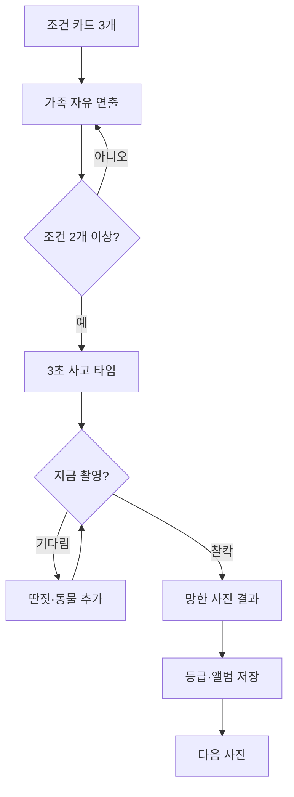

# 게임 루프

```mermaid
flowchart TD
    A["조건 카드 3개"] --> B["가족 자유 연출"]
    B --> C{"조건 2개 이상?"}
    C -- "아니오" --> B
    C -- "예" --> D["3초 사고 타임"]
    D --> E{"지금 촬영?"}
    E -- "기다림" --> F["딴짓·동물 추가"]
    F --> E
    E -- "찰칵" --> G["망한 사진 결과"]
    G --> H["등급·앨범 저장"]
    H --> I["다음 사진"]
```
