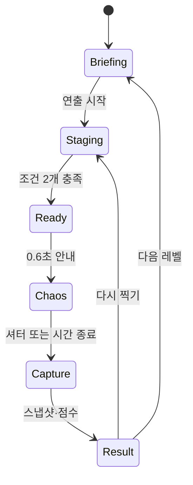

# 상태 흐름

```mermaid
stateDiagram-v2
    [*] --> Briefing
    Briefing --> Staging: 연출 시작
    Staging --> Ready: 조건 2개 충족
    Ready --> Chaos: 0.6초 안내
    Chaos --> Capture: 셔터 또는 시간 종료
    Capture --> Result: 스냅샷·점수
    Result --> Briefing: 다음 레벨
    Result --> Staging: 다시 찍기
```
