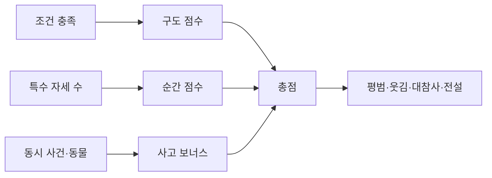

# 점수 흐름

```mermaid
flowchart LR
    A["조건 충족"] --> D["구도 점수"]
    B["특수 자세 수"] --> E["순간 점수"]
    C["동시 사건·동물"] --> F["사고 보너스"]
    D --> G["총점"]
    E --> G
    F --> G
    G --> H["평범·웃김·대참사·전설"]
```
